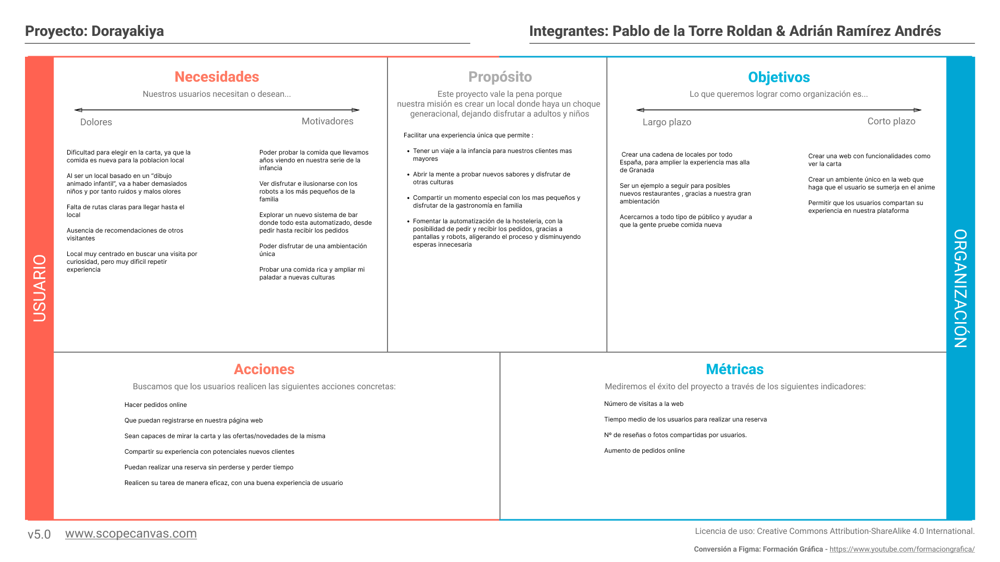
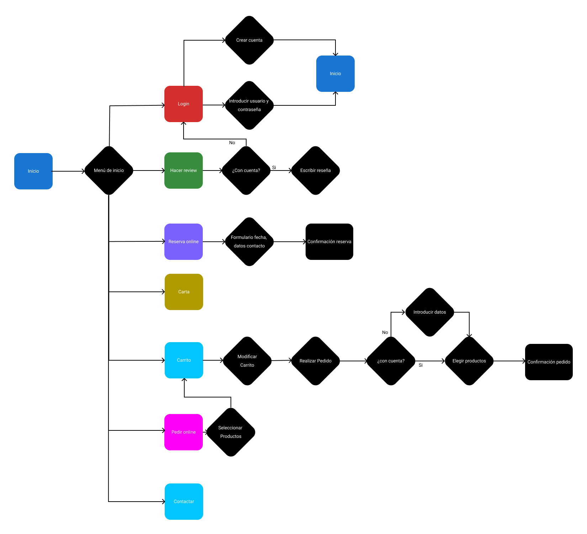
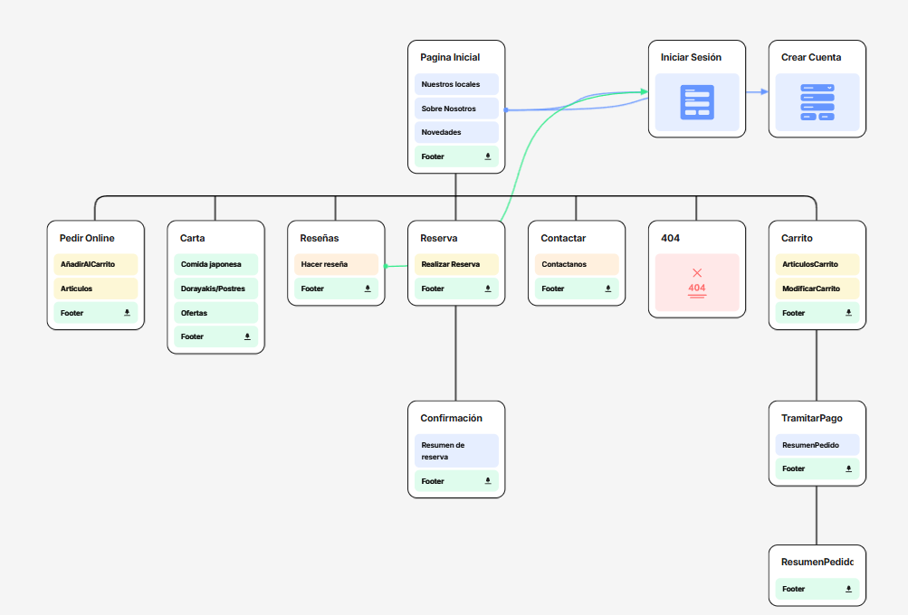
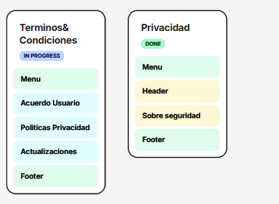
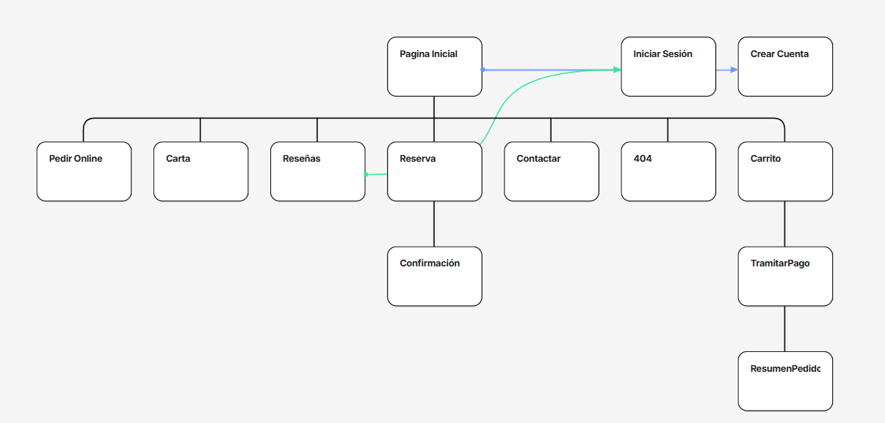

# Entregable P2 DIU
Este .md tiene el mismo contenido que el **CAMBIAR ENLACE**[pdf entregado por prado](enlace_a_pdf). Sin embargo, tiene enlaces a los archivos multimedia en el repositorio de Github.
## 1. Case study
¿Y si hubiera un restaurante donde pudiéramos fusionar el disfrute de varias generaciones, con un anime tan mítico como Doraemon?

Esto mismo nos preguntamos nosotros cuando decidimos llevar a cabo esta iniciativa. Un gastrobar donde no tan solo podías disfrutar de la comida típica del anime, sino que ver a “réplicas” del protagonista como tus propios camareros.

**Tiempo:** Lo que queda de semestre.

**Equipo:** Diseñadores UX: Pablo de la Torre y Adrián Ramírez.

**Objetivos:**
* Crear un espacio disfrutable por personas de un amplio abanico de edades.
* Recrear de la manera más realista posible la gastronomía de este anime.
* Crear una experiencia única, innovadora e inolvidable que nos permita saborear el futuro, con nuestros robots camareros.

**Oportunidad:**
Llevar nuestra idea a la realidad es totalmente factible, ya que la tecnología está inventada. Ya hay varios restaurantes con camareros robots. Solo tendríamos que modificarlos levemente para hacer que se asemejen a Doraemon y el local no es difícil de conseguir. Como tal en España, no encontramos mucha información sobre locales similares al nuestro. Aunque la idea de un gastrobar basado en un anime no es nueva, un local en concreto con el matiz de doraemon y la tecnología no existe. Creímos por ello que tenía bastante sentido darle la oportunidad de llevarse a cabo, ya que con la temática y los robots se va a publicitar solo y si conseguimos una calidad gastronómica buena, podemos sacarlo adelante.

**Quienes son nuestros usuarios y que necesitan:**
Lo bonito de nuestro local, es que no está diseñado para un público concreto. Doraemon es un anime multigeneracional, lo que permite que adultos y pequeños tengan curiosidad por visitarlo. Pero en concreto, sabemos que nuestro principal público son familias , incitadas a acudir por la petición de sus hijos, que actualmente disfrutan los “dibujos animados”

**Análisis de la competencia:**
Tras realizar el análisis competitivo de la práctica 1 hemos identificado varios aspectos positivos y negativos de nuestra competencia y sus páginas web.
Por un lado, algunas aplicaciones destacan por su diseño visual atractivo y  ofrecer gran cantidad de información sobre los locales, como valoraciones, imágenes o descripciones detalladas. Esto facilita que el usuario pueda explorar opciones rápidamente y tomar decisiones.
Sin embargo, también presentan varios problemas. En muchos casos, la experiencia resulta poco personalizada, ya que las recomendaciones no se adaptan realmente a los gustos del usuario. Además, la navegación puede ser confusa o puede estar saturada de información, dificultando encontrar lo que se busca de forma rápida (aspecto clave sabiendo el tiempo que de media pasa un usuario en una web)
En comparación, Dorayakiya busca mejorar estos aspectos apostando por una experiencia más centrada en el usuario, con recomendaciones personalizadas y una interfaz más clara y sencilla, evitando la sobrecarga de información.

**Diseño centrado en el usuario para recabar información:**
En la práctica anterior diseñamos dos potenciales usuarios con perfiles muy distintos. El objetivo era contemplar los dos extremos de perfiles de usuarios que podrían estar interesados en nuestro proyecto. 

Uno de ellos era una persona joven con conocimientos tecnológicos avanzados que estaba muy interesada en la gastronomía japonesa y el anime, mientras que el otro era una persona más mayor con características opuestas que no estaba interesada pero hacía un esfuerzo por sus hijos.

**Problemas que debemos evitar y cosas que debemos incluir:**
Debemos evitar que la interfaz sea poco intuitiva, que empeore el rendimiento dependiendo del dispositivo que se use y sobrecargar al usuario con estímulos innecesarios. 

Debemos incluir mantenimiento periódico de la web para que todas las funcionalidades estén operativas. Además la página debe ser adecuada para la temática y el tipo de negocio elegido, con un menú simple y con pocos niveles, que permita realizar todas las tareas con pocos clicks. También debemos guiar al usuario durante todo el uso de la web con errores claros.

## 2. Reframing & Ideación
### 2.1. Empathy Mapping
Los perfiles y experiencias de ambos usuarios son muy distintas, haciendo así que cada uno esté ligado a un contexto distinto. Por ejemplo, a Juan le molesta que haya muchos niños en el local mientras que para Antonio esto es una ventaja. Además, Antonio prefiere que le atiendan humanos y por el contrario, a Juan le gusta menos las interacciones con personas, ya que es introvertido, y prefiere que le atienda un robot. 

Dichos contextos y personalidades hacen que aunque lo que escuchen y vean sea parecido, sus sentimientos, lo que piensan, hacen y dicen es muy distinto. 

### 2.2. Feedback Capture Grid
Creemos que es conveniente implementar funcionalidades como ver el menú en la web, exponer reseñas de usuarios anteriores e implementar un sistema de puntos siempre y cuando conservemos la estética, rendimiento y simplicidad de la página. Además debemos hacer que el mantenimiento de la página sea sencillo e intentar que los usuarios que ya han probado el servicio sigan teniendo ganas de volver a ir. Algunos aspectos buenos de la competencia son la simplicidad y rendimiento de la página y la capacidad de ejecutar la página en un móvil sin que se vea mal.

## 3. Scope Canvas
Queremos crear un gastrobar donde no tan sólo puedes disfrutar de la comida típica del Doraemon, sino ver a “réplicas” del protagonista como tus propios camareros. Daremos muchísima importancia a la ambientación, tanto de la página web, como del local. Como exploramos un nicho de mercado donde hay muchos potenciales consumidores con poco uso de internet, nos centraremos en que la web sea intuitiva y óptima.

## 4. Task Analysis
Para realizar el análisis de tareas hemos utilizado la estrategia Task Flow. En ella se ven reflejadas las funcionalidades de la web y los pasos a seguir para realizarlas. Entre dichas funcionalidades están: 
* Iniciar sesión / Crear cuenta
* Hacer review
* Reservar online
* Ver la carta
* Pedir online
* Contactar con el local
Para hacer una review se requiere iniciar sesión y para pedir online se requiere introducir el correo o teléfono, dirección y tarjeta de crédito, pero no hace falta iniciar sesión. Además, al hacer una reserva o pedido online se muestra una página de confirmación.

## 5. Arquitectura de Información
### 5.1. SiteMap
Con nuestro diseño del SiteMap hemos intentado conseguir que el usuario realice sus objetivos con el menor número de clicks posibles. Hemos decidido incluir una página por cada tarea descrita en el Task Analysis, a las que se puede acceder desde la barra de navegación en la página inicial. Además se usa una página de confirmación para el pedido online y la reserva online.

### 5.2. Labelling
Término | Significado     
| ------------- | -------
  Página de inicio | Página principal. Acceso rápido a todas las secciones del gastrobar
  Iniciar Sesión | Inicio de sesión o registro de usuario. Necesario para escribir reseñas
  Pedir Online | Formulario para pedir a domicilio o recogida, con opción de realizar el pago
  Carta | Menú completo: Platos japoneses del anime y dorayakis u otros postres
  Reseñas | Lista de reseñas. Escribir una nueva reseña(requiere iniciar sesión previamente)
  Reserva | Formulario para reservar mesa online con antelación. Confirmación automática
  Contactar | Formulario para contactar con los restaurantes
  Error 404 | Mensaje mostrado cuando por cualquier motivo la página no es encontrada

## 6. Prototipo
### 6.1. Esbozo en papel

### 6.2. Wireframe preeliminar en Figma

### 6.3. Segunda versión con grid layout y responsive
