# Práctica 3 DIU

---

## 1. Moodboard

### 1.1. Estrategia

El objetivo principal de **DorayakiYa** es crear un espacio pensado para todas las edades, especialmente familias, donde los clientes puedan disfrutar de platos característicos del anime mientras son atendidos por robots camareros con la apariencia del protagonista.

Queremos generar una experiencia **inmersiva, original y memorable** que destaque tanto por su ambientación como por su propuesta gastronómica.

Para ello nuestra estrategia consistirá en crear un ambiente agradable para todas las personas de la familia en la página web, haciendo inmersiva y fácil la interacción con el sistema.

---

### 1.2. Imágenes de inspiración

| | |
|---|---|
| 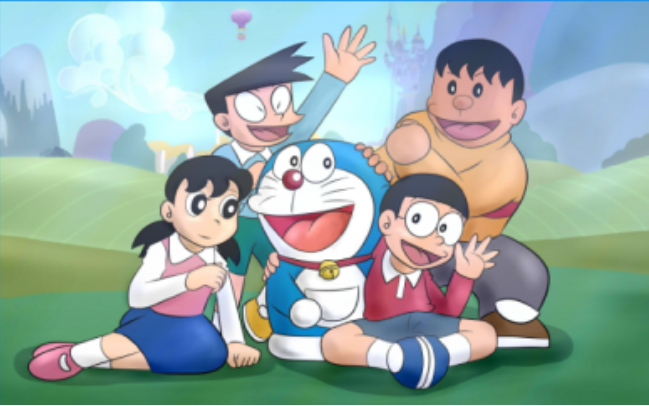 | 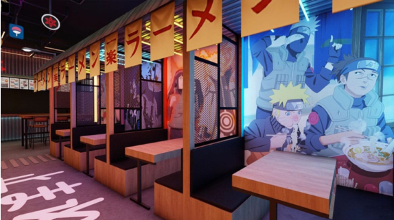 |
| 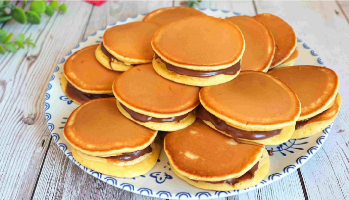 | 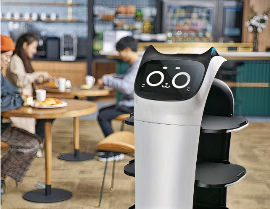 |

---

### 1.3. Colores

Nuestra paleta se basa en una **armonía monocromática**, usando distintos tonos de azul como colores principales y el amarillo como color secundario para crear contraste.

Como color principal, el **azul** actúa como ancla visual. El uso de un tono cian saturado transmite confianza y transparencia. Al estar asociado al personaje principal, establece una conexión directa de identidad que facilita el reconocimiento de marca y hace que el usuario la recuerde más fácilmente.

Se ha complementado el tono principal con un azul más claro y otro más oscuro, para utilizarlos en elementos similares.

> El negro y blanco no son `#FFFFFF` o `#000000` para evitar la fatiga al leer.

---

### 1.4. Tipografía

Hemos elegido **Fredoka One** para los títulos por su simpleza y estilo moderno. También hemos elegido **Baloo 2** para el texto, por su facilidad de leer y diferenciación del fondo.

Esta combinación encaja especialmente bien con nuestra marca porque ambas tipografías comparten formas redondeadas y suaves, lo que transmite cercanía, amabilidad y un tono desenfadado. Estos valores son clave en un local inspirado en Doraemon, donde buscamos generar una experiencia divertida, accesible y familiar.

**Fredoka One** aporta personalidad y atractivo visual en títulos y elementos importantes, captando rápidamente la atención del usuario y reforzando el carácter lúdico del restaurante. **Baloo 2** equilibra ese impacto visual con una lectura cómoda y fluida en textos largos, evitando la fatiga y facilitando la navegación por la web.

---

### 1.5. Logo

Nuestro estilo es amigable y juguetón, inspirado en Doraemon. Con nuestro logo queremos hacer énfasis en nuestra principal atracción (Doraemon), a la vez que en nuestro plato estrella (los dorayakis).

Además utilizamos **tipografía japonesa** para añadir un extra de inmersión en la cultura japonesa. Los colores utilizados para las alternativas del logo son los colores secundarios propuestos.

---

### 1.6. Nuestras Imágenes

> "Las imágenes seleccionadas reflejan la esencia de DorayakiYa al combinar tecnología, gastronomía y una experiencia visual atractiva. Por un lado, el robot camarero transmite modernidad e innovación, posicionando al restaurante como un espacio diferente y tecnológico. Por otro, la imagen de la familia disfrutando de la comida muestra el ambiente cercano, divertido y familiar que se quiere ofrecer a clientes de todas las edades. Finalmente, la imagen de los platos destaca la propuesta gastronómica, mostrando comida típica del anime con un aspecto muy cuidado, colorido y apetecible, que refuerza la idea de una experiencia inmersiva y memorable.
> 
> En conjunto, estas imágenes comunican un equilibrio entre tecnología, entretenimiento y calidad culinaria, elementos clave de la identidad de la marca."

| | | |
|---|---|---|
| 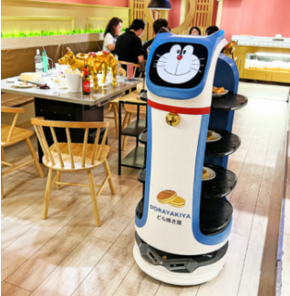 | 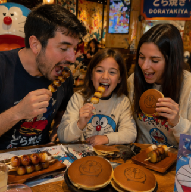 | 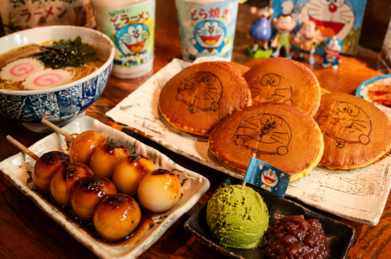 |

---

### 1.7. Comentarios

**Nuestro público objetivo es:**

- Jóvenes que buscan experiencias relacionadas con el anime
- Niños que ven el anime a diario por la televisión
- Fans de la tecnología
- Personas interesadas en probar gastronomía nueva

**Comentarios de usuarios:**

> *"No es solo comer, es vivir el anime. Todo está cuidado al detalle, desde la web hasta el local."*

> *"Perfecto para venir en familia, los niños fliparon con los camareros estilo anime. Muy original y bien ambientado."*

---

### 1.8. Frase Motivadora

**Nuestro slogan:**

> # *"Sabores desde el bolsillo mágico."*

El eslogan *"Sabores que salen del bolsillo mágico"* se inspira en el concepto del bolsillo mágico de Doraemon, entendido como un símbolo de sorpresa, imaginación y aparición inesperada de objetos.

En nuestro restaurante, esta idea se traslada a la experiencia del servicio: la comida no se sirve de forma tradicional, sino que es transportada por robots camareros con apariencia del propio Doraemon, generando la sensación de que los platos llegan directamente desde ese bolsillo mágico.

---

### 1.9. Moodboard Completo

---

## 2. Landing Page

La página principal diseñada es la siguiente:

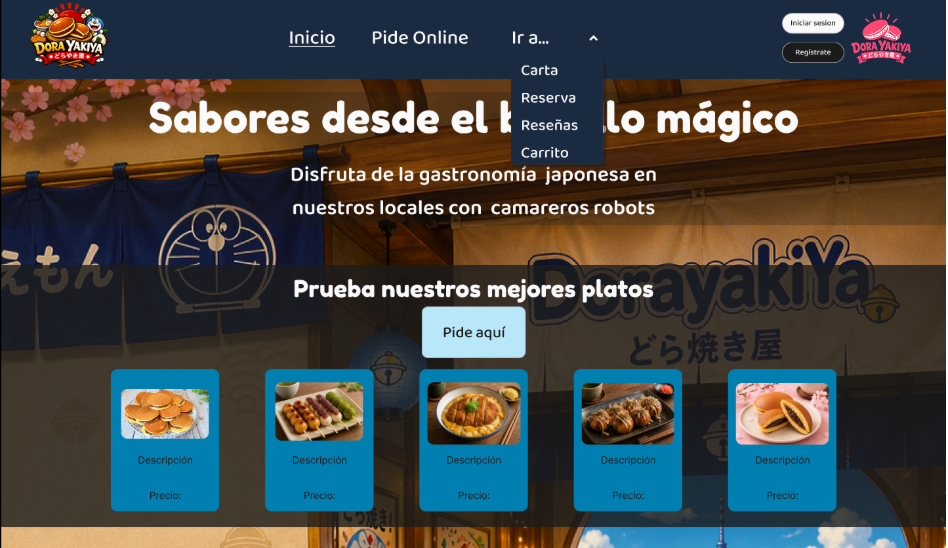

Hemos utilizado **botones para la barra de navegación principal**. El botón *Ir a…* muestra un desplegable que nos ayudará a poder navegar por la página web, permitiéndonos ir a "Sobre Nosotros", "Nuestros locales", "Novedades" u otras partes de nuestra página que no se encuentran en la página principal.

Además tenemos el logo principal de la empresa en grande en el lado izquierdo, y el minimalista algo más pequeño a la derecha. El landing sigue una **estética minimalista** para facilitar a que el público objetivo sea capaz de navegar sin saturarse.

En el bloque principal tenemos una imagen de referencia de nuestro local y sobre ella la descripción de la empresa: primero el objetivo, que pida online, los locales que puede encontrar y algo más llamativo, la sección de novedades/ofertas. Por último un **footer** del mismo color que la cabecera, donde tenemos la información menos relevante, pero priorizando que se vean las redes sociales.

- **Título:** Sabores desde el bolsillo mágico
- **Subtítulo:** Disfruta de la gastronomía japonesa en nuestros locales con camareros robots
- La imagen de refuerzo es la del fondo, la supuesta foto de nuestro local
- La propuesta es deseable porque facilitamos al público objetivo encontrar todo de manera sencilla, y hacer una ambientación adecuada para la temática que sigue nuestro negocio. Además provoca esa emoción de curiosidad, ya que al no ser exagerada, te invita a explorar y a descubrir más, despertándote también la curiosidad sobre cómo será la comida y la experiencia.

Como comentamos arriba ponemos muy a la vista el **botón de pedir online** porque nos interesa facturar (somos un negocio) y las **noticias** (incitan a los clientes a venir).

---

## 3. Lenguaje Visual: Design System

### a) Definición de Foundations (Cimientos del sistema)

**Sistema de color:** Hemos clasificado los colores de la siguiente manera:

| Nombre | Valor |
|---|---|
| Color Principal | `#1A2A40` |
| Color Secundario 1 | `#027FB1` |
| Color Secundario 2 | `#FDD34F` |
| Negro | `#1B1B1B` |
| Blanco | `#FAFAFA` |
| Color Terciario | `#B8E7FA` |
| Gris | `#C1C1C1` |
| Fondo textos | `#1B1B1B` al 80% |

Donde tenemos como **color principal** (footer y header) un azul oscuro, como **colores secundarios** (elementos importantes a segundo plano) el amarillo pastel para las novedades y el azul "doraemon" para los pedidos online. También usamos blanco y negro para el texto y los logos.

**Arquitectura Tipográfica:** Usamos para los títulos la tipografía **Fredoka One**, y para descripciones y textos menos importantes, **Baloo 2**, algo más formal y que fatiga menos la vista.

**Grid & Spacing:** Usamos un espaciado estandarizado basado en **múltiplos de 8px** para que todo se vea ordenado, sea consistente y se facilite el web responsive.

---

### b) Atomic Design

#### Átomos

Usamos como átomos los distintos botones, texto, colores y las imágenes. Es decir, los elementos más básicos del sistema de diseño, que constituyen la base para la construcción del resto de componentes. Posteriormente añadimos la imagen del fondo de nuestra web como átomo.

**Estilos de texto definidos:**

| Estilo | Tamaño |
|---|---|
| Botones | 24/150 |
| P | 24/Auto |
| H1 | 64/Auto |
| H3 | 32/Auto |
| H2 | 36/Auto |
| Botón Pequeño | 12/150 |
| Botón Menú | 30/150 |
| P mini mini | 15/Auto |
| P mini | 19/Auto |

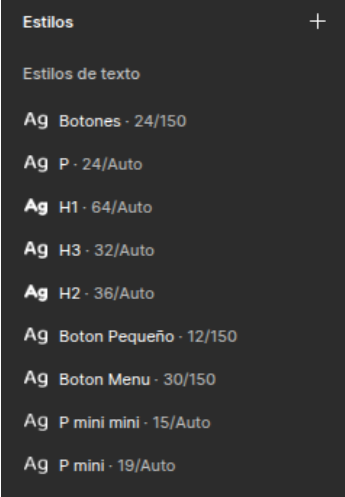

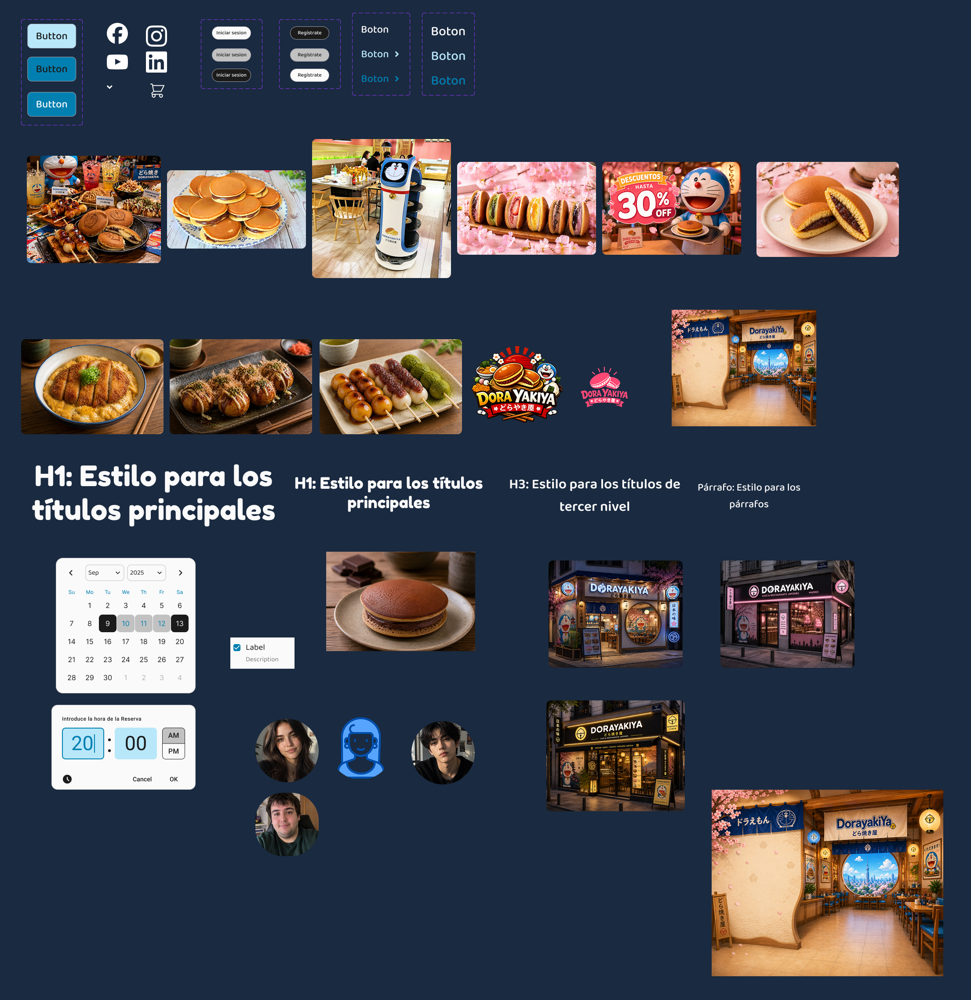

---

#### Moléculas

**1. Menú Dropdown** para mostrar distintas opciones en el header y navegar rápidamente.

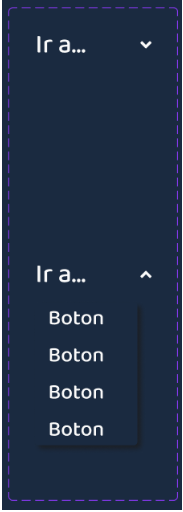

**2. Tarjetas** para mostrar Productos, Restaurantes, Noticias… en distintos formatos. Están compuestas por texto e imágenes.

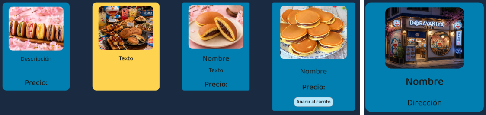

**3. Widgets de fecha y hora** para hacer una reserva. Con ellos el usuario podrá indicar la fecha exacta de su reserva.

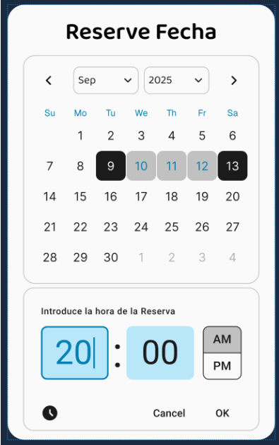

**4. Botón del carrito:** Botón que consta del icono del carrito y un botón normal.

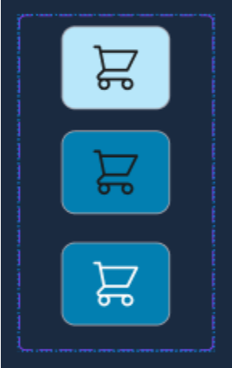

**5. Tarjetas** para las reseñas existentes, añadir una reseña nueva y artículos del carrito.

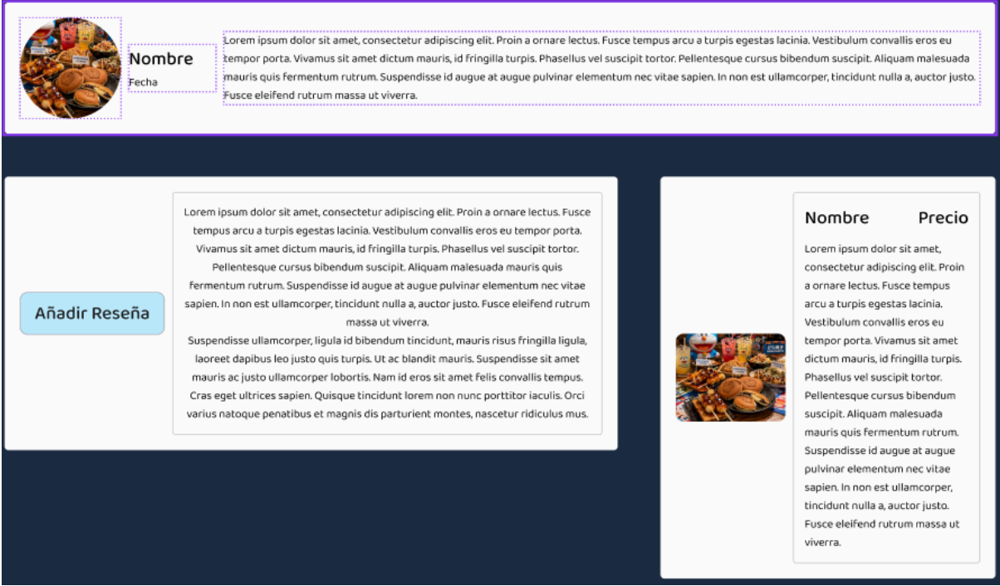

**6. Fondo negro semitransparente** con título y texto.

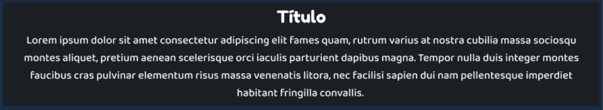

---

#### Organismos

**1. Header (Navbar):** Está compuesto por el logo principal, el minimalista y el menú (molécula de botones).

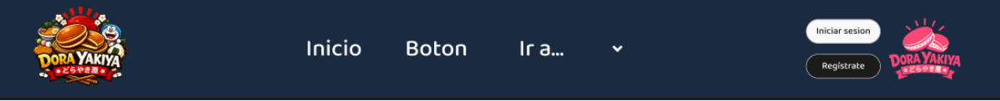

**2. Footer:** Aquí encontramos los links, las redes sociales (que serán otra molécula) y juntas forman el organismo.

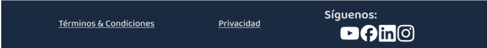

**3. Producto del carrito:** Producto en el carrito con su checkbox para marcarlo.

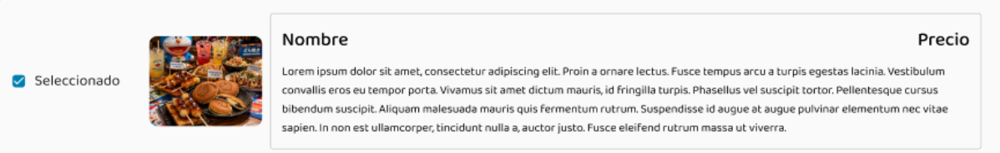

**4. El menú de navegación:** Menú para navegar rápidamente que se despliega gracias a la molécula menú dropdown.

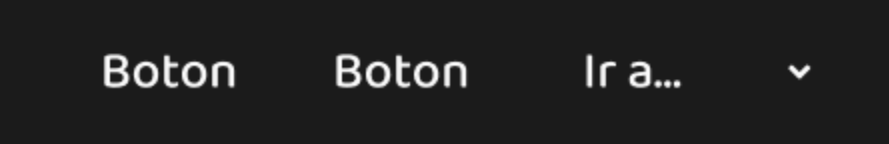

---

#### Patrones

**Patrón 1 — Exploración de productos:**

Este patrón tiene como objetivo facilitar la exploración de la oferta gastronómica por parte del usuario.

Está compuesto por la combinación de distintos organismos como la sección de bienvenida (hero), el listado de productos destacados y la sección de novedades. Su función es captar la atención del usuario y permitirle descubrir de forma visual y estructurada los distintos productos disponibles, fomentando la interacción y el interés.

**Patrón 2 — Información:**

Este patrón está orientado a proporcionar información relevante sobre el negocio. Se compone de organismos como "Sobre nosotros" y "Nuestros locales", que permiten al usuario conocer tanto la identidad del restaurante como su ubicación y contexto. Su objetivo es reforzar la confianza del usuario y ofrecer contenido informativo de manera clara y accesible.

---

## 4. Layout (HI-FI)

El layout final se ha desarrollado en **Figma** aplicando los principios de Atomic Design, organizando la interfaz en una jerarquía clara de header, contenido y footer. Además, se han implementado componentes reutilizables y se han simulado interacciones como navegación y estados de botones, generando un prototipo funcional.

Todos los botones con enlaces a páginas implementadas son funcionales y el dropdown menu de la barra de navegación en el header también.

**Página de inicio (con dropdown):**

**Página de la Carta:**

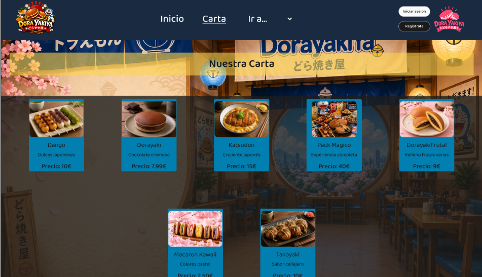

**Página de Reserva:**

Para la reserva se ha utilizado los recursos de reloj y calendario sacados de Figma.

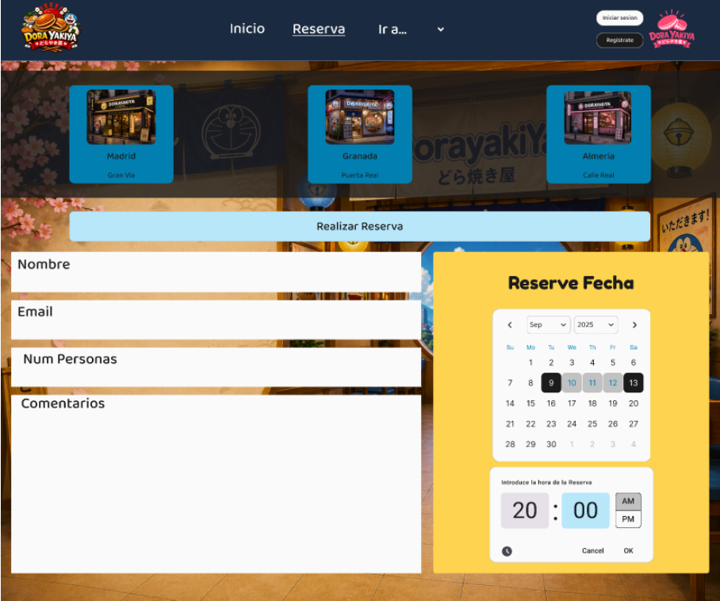

**Página de Reseñas:**

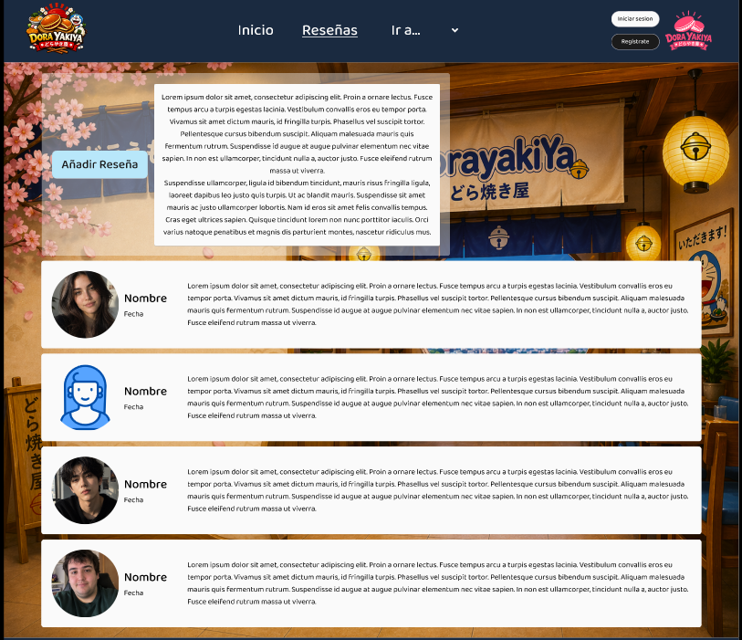

**Página del Carrito:**

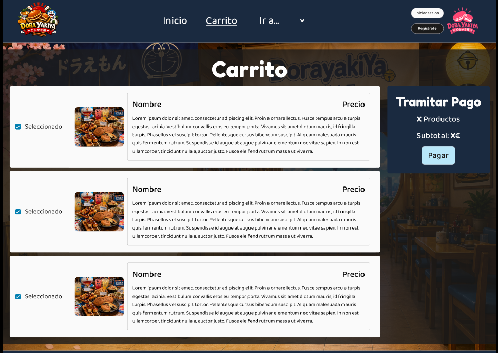

---

## 5. Briefing Final

Las herramientas de IA utilizadas han sido **Figma Make** para crear parte del Landing Page y **ChatGPT** para generar las imágenes de nuestro prototipo.

El proceso de diseño ha sido el siguiente:

Primero hemos definido nuestro estilo y nuestros objetivos como empresa con el **moodboard**. Luego hemos pasado a hacer un prototipo simple bastante rudimentario (**landing page**) para empezar a comprender cómo queríamos que se viera nuestra web. Una vez que teníamos clara la estructura y el estilo, hemos pasado a **atomizar** todos los componentes que íbamos a necesitar después, para hacernos la vida más fácil a la hora de desarrollarla. Por último hemos utilizado los componentes creados para terminar la primera versión de nuestro proyecto (**Modelo HI-FI**), con el que tenemos **5 páginas** sobre las que ir navegando.
