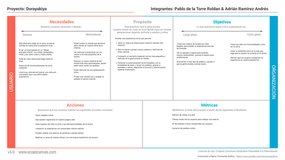
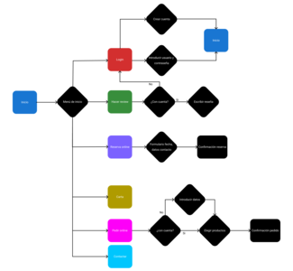

# DIU26
Prácticas Diseño Interfaces de Usuario (Tema: .... ) 

* [Guiones de prácticas](GuionesPracticas/)
* [Guía para crea tu Case Study](Guia_CaseStudy.md)
* Sala de la Fama [DIU Hall of fame](https://github.com/mgea/DIU/tree/master/hall_of_fame) donde se pueden encontrar Case Study destacados de otros años.

Actualizado: 14/01/2026

## Paso 0 My UX-Case Study
 
-----

Grupo: DIU1.Zipizape.  Curso: 2025/26 

Nombre del Proyecto: 

**Dorayakiya**

Descripción: 

Queremos crear un restaurante que esté ambientado en el anime Doraemon. La carta estará basada en los platos típicos de la cultura japonesa que están presentes en el anime y los camareros serán robots que se asemejan al personaje principal Doraemon. Dichos camareros serán la atracción principal del restaurante, sirviendo platos desde su bolsillo mágico.

Logotipo: 

>>> Si diseña un logotipo para su producto en la práctica 3 pongalo aqui, a un tamaño adecuado. Si diseña un slogan añadalo aquí

Miembros y nombre del equipo:
 * :bust_in_silhouette:  Pablo de la Torre Roldán     :octocat:     https://github.com/pablovroldanUGR
 * :bust_in_silhouette:  Adrián Ramírez Andrés     :octocat:        https://github.com/Rammrezzz

----- 

 

# Proceso de Diseño 

 

## Paso 1. UX User & Desk Research & Analisis 

### 1.a User Reseach Plan
 
-----

Pensamos usar Usability Testing, entrevistas y Unmoderated Testing para la selección de nuestros usuarios. Pretendemos priorizar métodos cualitativos, que prioricen las acciones del usuario y que mezclen tanto un contexto natural como preestablecido.

### 1.b Competitive Analysis
 
-----

Las aplicaciones asignadas tienen bastante buena tamática y diseño pero no priorizan la simpleza y sobreestimulan al usuario con elementos innecesarios. Hemos decidido seleccionar Anime Ramen para analizarlo por sus funcionalidades extra que las demás no tienen y su compatibilidad con varios tipos de dispositivos.

### 1.c Personas
 
-----

Hemos creado dos perfiles de usuarios muy distintos. Uno de ellos es un “friki” de los videojuegos y el anime mientras que el otro es un padre de familia divorciado que no tiene prácticamente ningún manejo con los dispositivos y que va a entrar en la página para llevar a comer a sus hijos.

Primera persona: 

Segunda persona:

### 1.d User Journey Map
 
----

La primera experiencia de usuario describe el comportamiento de una persona introvertida que no quiere salir de casa pero tiene curiosidad por el local y quiere descubrir cosas nuevas. Tiene una clara preocupación por la cercanía de la ubicación del local que representa bastante bien su personalidad y es un usuario que pretende conseguir lo que quiere de forma rápida y eficiente. Es un comportamiento bastante acertado que finalmente pida la comida a domicilio por su personalidad introvertida.

La segunda experiencia de usuario define la forma de actuar de una persona a la que no le interesa ni la gastronomía ni el local, pero que acaba yendo para acompañar a su familia. Su pobre manejo con la tecnología le dificulta hacer una reserva, por lo que se ve afectada en gran medida su experiencia. Además, creemos que es muy habitual el pensamiento de "tendré que cenar en casa" al no gustarle el menú. 

### 1.e Usability Review
 
----

* [Análisis de usabilidad](P1/imgs/UsabilityReview.pdf)
* La valoración obtenida ha sido 71/100.
* Los puntos fuertes son el diseño atractivo y coherente con la temática y el rendimiento de la página, además de la compatibilidad entre dispositivos de la misma.
* Los puntos débiles son la navegación poco intuitiva y el pobre trabajo de mantenimiento.

 

## Paso 2. UX Design  
[enlace al entregable de la P2](P2/README.md)

### 2.a Reframing / IDEACION: Feedback Capture Grid / Empathy map 
Del Empathy Map hemos concluido que los perfiles y experiencias de ambos usuarios son muy distintas, haciendo así que cada uno esté ligado a un contexto distinto. Sin embargo, ambos usuarios esperan que el restaurante sea un lugar amplio y adaptado para toda la familia. Los robots son la atracción principal y en general gustan a todo el público, aunque tengan diferentes opiniones sobre ellos.

 
----

El principal problema es mantener la atención de los clientes, haciendo que quieran repetir la experiencia en vez de ser un sitio al que van una vez para ver los robots y no aparecer nunca más. Podemos solucionarlo y conseguir que repitan añadiendo promociones al menú y haciendo cambios sutiles en él. El principal punto fuerte es que toda la familia puede disfrutar de la experiencia.

 Interesante | Críticas     
| ------------- | -------
  Preguntas | Nuevas ideas
  

### 2.b ScopeCanvas

----
Queremos crear un gastrobar donde no tan sólo puedes disfrutar de la comida típica del Doraemon, sino ver a “réplicas” del protagonista como tus propios camareros. Daremos muchísima importancia a la ambientación, tanto de la página web, como del local. Como exploramos un nicho de mercado donde hay muchos potenciales consumidores con poco uso de internet, nos centraremos en que la web sea intuitiva y óptima.

### 2.b User Flow (task) analysis 
 
-----

Vamos a utilizar la técnica task flow para definir las principales funcionalidades y su importancia para los usuarios.

### 2.c IA: Sitemap + Labelling 
 
----
Con nuestro diseño del SiteMap hemos intentado conseguir que el usuario realice sus objetivos con el menor número de clicks posibles. Hemos decidido incluir una página por cada tarea descrita en el Task Analysis, a las que se puede acceder desde la barra de navegación en la página inicial. Además se usa una página de confirmación para el pedido online y la reserva online.

Término | Significado     
| ------------- | -------
  Página de inicio | Página principal. Acceso rápido a todas las secciones del gastrobar
  Iniciar Sesión | Inicio de sesión o registro de usuario. Necesario para escribir reseñas
  Pedir Online | Formulario para pedir a domicilio o recogida, con opción de realizar el pago
  Carta | Menú completo: Platos japoneses del anime y dorayakis u otros postres
  Reseñas | Lista de reseñas. Escribir una nueva reseña(requiere iniciar sesión previamente)
  Reserva | Formulario para reservar mesa online con antelación. Confirmación automática
  Contactar | Formulario para contactar con los restaurantes
  Error 404 | Mensaje mostrado cuando por cualquier motivo la página no es encontrada

### 2.d Wireframes
 
-----

>>> Plantear el diseño del layout para Web/movil (organización y simulación). Describa la herramienta usada
Para hacer el wireframe hemos utilizado Figma. Con un click basta para entrar a cada menú. 

 

## Paso 3. Mi UX-Case Study (diseño)

>>> Cualquier título puede ser adaptado. Recuerda borrar estos comentarios del template en tu documento

### 3.a Moodboard

-----

>>> Diseño visual con una guía de estilos visual (moodboard) 
>>> Incluir Logotipo. Todos los recursos estarán subidos a la carpeta P3/
>>> Explique aqui la/s herramienta/s utilizada/s y el por qué de la resolución empleada. Reflexione ¿Se puede usar esta imagen como cabecera de Instagram, por ejemplo, o se necesitan otras?

### 3.b Landing Page
 
----

>>> Plantear el Landing Page del producto. Aplica estilos definidos en el moodboard

### 3.c Guidelines
 
----

>>> Estudio de Guidelines y explicación de los Patrones IU a usar 
>>> Es decir, tras documentarse, muestre las deciones tomadas sobre Patrones IU a usar para la fase siguiente de prototipado. 

### 3.d Mockup
 
----

>>> Consiste en tener un Layout en acción. Un Mockup es un prototipo HTML que permite simular tareas con estilo de IU seleccionado. Muy útil para compartir con stakeholders

 

## Paso 4. Pruebas de Evaluación 

### 4.a Reclutamiento de usuarios 

-----

>>> Breve descripción del caso asignado (llamado Caso-B) con enlace al repositorio Github
>>> Tabla y asignación de personas ficticias (o reales) a las pruebas. Exprese las ideas de posibles situaciones conflictivas de esa persona en las propuestas evaluadas. Mínimo 4 usuarios: asigne 2 al Caso A y 2 al caso B.

| Usuarios | Sexo/Edad     | Ocupación   |  Exp.TIC    | Personalidad | Plataforma | Caso
| ------------- | -------- | ----------- | ----------- | -----------  | ---------- | ----
| User1's name  | H / 18   | Estudiante  | Media       | Introvertido | Web.       | A 
| User2's name  | H / 18   | Estudiante  | Media       | Timido       | Web        | A 
| User3's name  | M / 35   | Abogado     | Baja        | Emocional    | móvil      | B 
| User4's name  | H / 18   | Estudiante  | Media       | Racional     | Web        | B 

### 4.b Diseño de las pruebas 
 
-----

>>> Planifique qué pruebas se van a desarrollar. ¿En qué consisten? ¿Se hará uso del checklist de la P1?

### 4.c Cuestionario SUS
 
----

>>> Como uno de los test para la prueba A/B testing, usaremos el **Cuestionario SUS** que permite valorar la satisfacción de cada usuario con el diseño utilizado (casos A o B). Para calcular la valoración numérica y la etiqueta linguistica resultante usamos la [hoja de cálculo](https://github.com/mgea/DIU19/blob/master/Cuestionario%20SUS%20DIU.xlsx). Previamente conozca en qué consiste la escala SUS y cómo se interpretan sus resultados
http://usabilitygeek.com/how-to-use-the-system-usability-scale-sus-to-evaluate-the-usability-of-your-website/)
Para más información, consultar aquí sobre la [metodología SUS](https://cui.unige.ch/isi/icle-wiki/_media/ipm:test-suschapt.pdf)
>>> Adjuntar en la carpeta P4/ el excel resultante y describa aquí la valoración personal de los resultados 

### 4.d A/B Testing
 
-----

>>> Los resultados de un A/B testing con 3 pruebas y 2 casos o alternativas daría como resultado una tabla de 3 filas y 2 columnas, además de un resultado agregado global. Especifique con claridad el resultado: qué caso es más usable, A o B?

### 4.e Aplicación del método Eye Tracking 

----

>>> Indica cómo se diseña el experimento y se reclutan los usuarios. Explica la herramienta / uso de gazerecorder.com u otra similar. Aplíquese únicamente al caso B.

  
>>> Cambiar esta img por una de vuestro experimento. El recurso deberá estar subido a la carpeta P4/  

>>> gazerecorder en versión de pruebas puede estar limitada a 3 usuarios para generar mapa de calor (crédito > 0 para que funcione) 

### 4.f Usability Report de B
 
-----

>>> Añadir report de usabilidad para práctica B (la de los compañeros) aportando resultados y valoración de cada debilidad de usabilidad. 
>>> Enlazar aqui con el archivo subido a P4/ que indica qué equipo evalua a qué otro equipo.

>>> Complementad el Case Study en su Paso 4 con una Valoración personal del equipo sobre esta tarea

 

## Paso 5. Exportación y Documentación 

### 5.a Exportación a HTML/React
 
----

>>> Breve descripción de esta tarea. Las evidencias de este paso quedan subidas a P5/

### 5.b Documentación con Storybook

----

>>> Breve descripción de esta tarea. Las evidencias de este paso quedan subidas a P5/

 

## Conclusiones finales & Valoración de las prácticas

>>> Opinión FINAL del proceso de desarrollo de diseño siguiendo metodología UX y valoración (positiva /negativa) de los resultados obtenidos. ¿Qué se puede mejorar? Recuerda que este tipo de texto se debe eliminar del template que se os proporciona 

